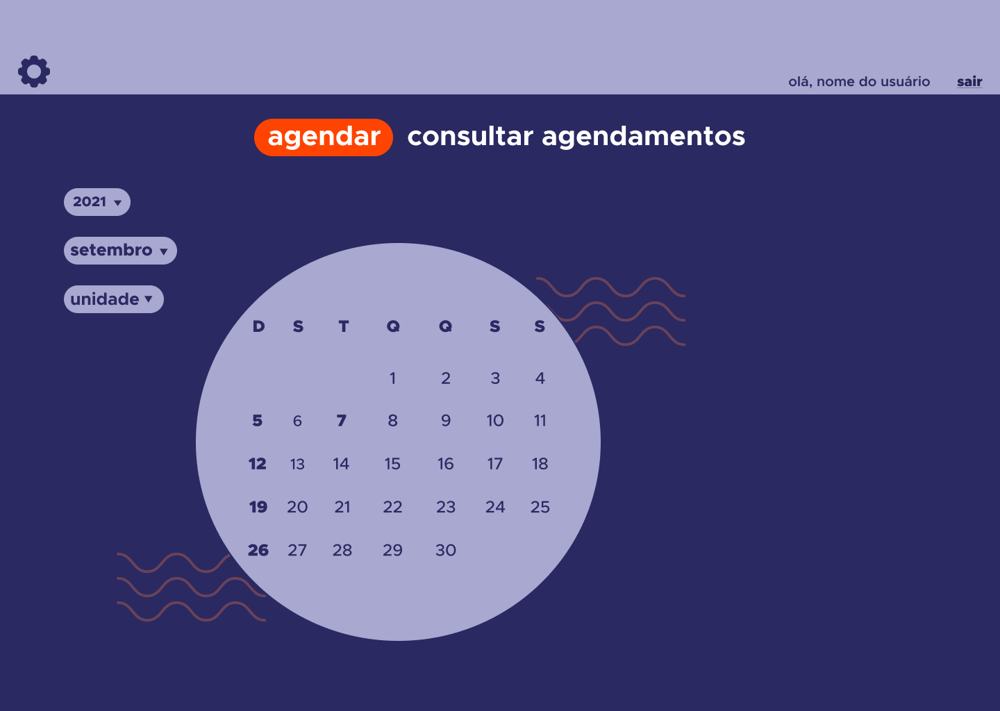
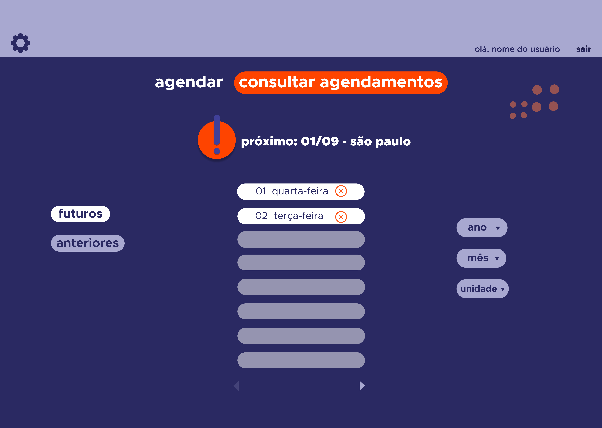
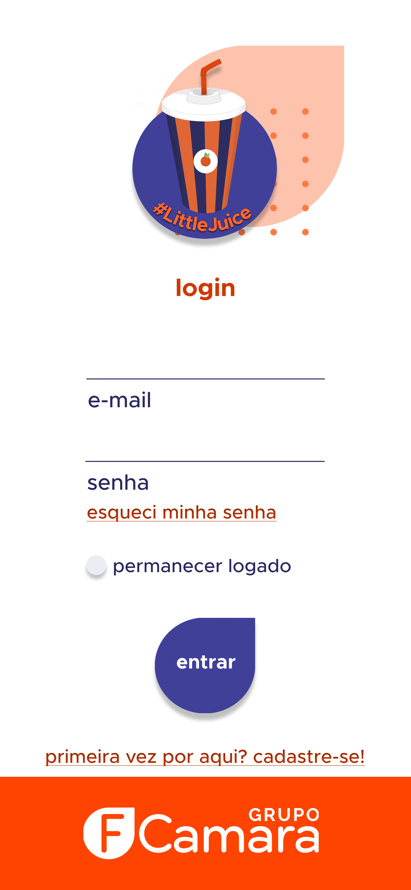
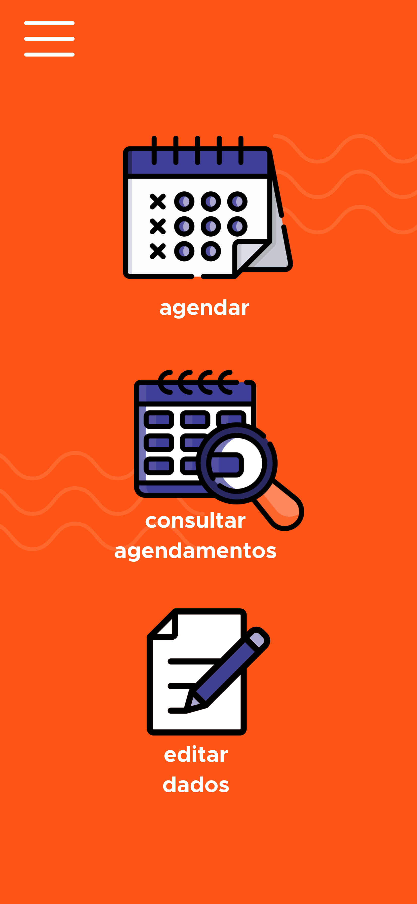

# Squad 32 - littleJuice

# Sobre o projeto

Little Juice é uma aplicação  web e mobile construída durante a edição do Hackathon **FCamara**, evento organizado pelo [Grupo FCamara](https://www.fcamara.com.br/ "Site da FCamara").

O projeto consiste em uma aplicação web responsiva chamada **Little Juice** na qual os funcionários da FCamara retomando aos poucos suas atividades presenciais ao escritório, vão poder agendar suas visitas a uma das filiais, respeitando os limites impostos pela Anvisa.

## Funcionalidades
   - **Acesso ao calendário para agendamentos**
   - **Consulta de agendamentos anteriores e futuros**
   - **Consulta e disponibilidade de vagas em cada dia**  
   
## Apresentação
[Pitch] | [Tutorial]
## Website

[Site tararam]

## Protótipo Básico

[Protótipo no Figma](https://www.figma.com/file/Z4mRu2qAWZPy84EZP8oRfQ/LittleJuice?node-id=0%3A1)

## Layout Web

## Layout Mobile

# Tecnologias utilizadas 
## Front-end
- HTML 
- CSS
- Javascript

## Back-end
- Typescript
- Node
- Nests
- Sequelize
- PostgreSQL

# Autores

Nome   | GitHub | Linkedin | Função
--------- | ------ | -------- | -----------
Agnaldo Pereira | [agnaldo26](https://github.com/agnaldo26) | [Agnaldo Pereira](https://www.linkedin.com/in/agnaldo-pereira-de-souza-silva-filho-8823081a6/) | FullStack 
Bruna Scheffelmeier |  | [Bruna Scheffelmeier](https://www.linkedin.com/in/bruna-scheffelmeier-197285219/) | UX Design
Drielison Lopes | [DrielisonLopes](https://github.com/DrielisonLopes) | [Drielison Lopes](https://www.linkedin.com/in/drielison-lopes/) | FullStack
Rodrigo Bernandes | [rsfbernardes](https://github.com/rsfbernardes) | [Rodrigo Bernandes](https://www.linkedin.com/in/rodrigobernardes10/) | FullStack
